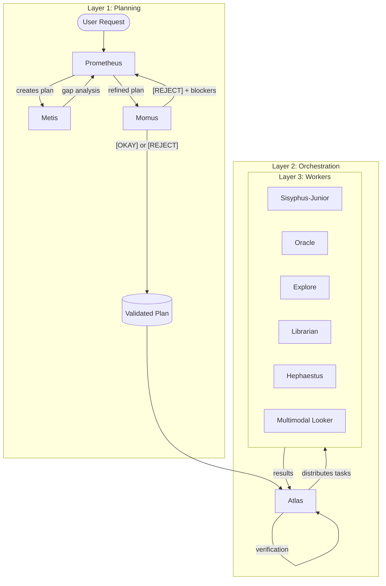
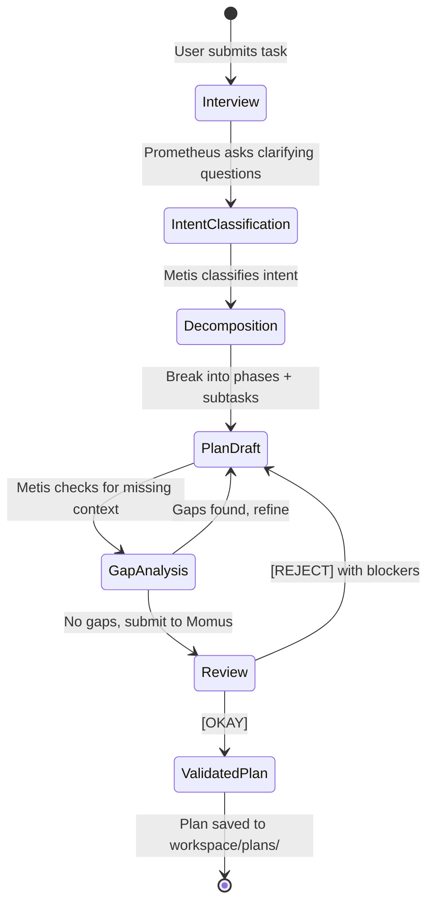
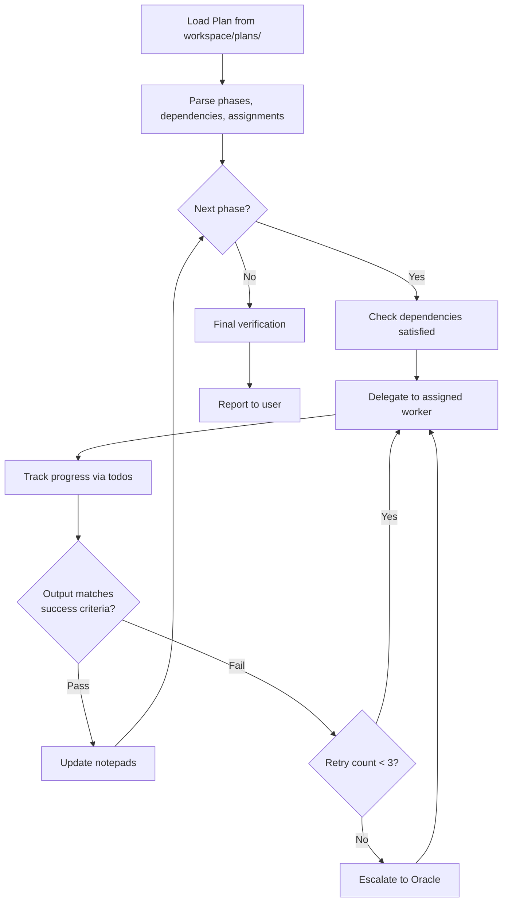

# Orchestration System Guide

**Planning and execution are separate concerns.** OhMyClaw enforces this boundary with a 3-layer architecture: planning agents think, an orchestrator coordinates, and workers execute. No layer crosses into another's domain.

This guide covers the full orchestration pipeline — from the moment a task enters the system to the moment it is verified complete.

---

## TL;DR - When to Use What

Not every task needs full orchestration. Choose the right entry point.

| Situation | What to Do | What Happens |
|-----------|-----------|--------------|
| Simple task (bug fix, small edit, search) | Just prompt naturally | Sisyphus-Junior handles it directly |
| Complex task, want it hands-off | `/ultrawork <description>` | Full pipeline: plan, review, execute, verify |
| Complex task, want control over the plan | `/plan <description>` then `/start_work` | You review the plan before execution begins |

**Decision flow:**

```
Is the task simple enough for one agent in one pass?
  YES -> Just prompt it. Done.
  NO  -> Do you want to review the plan before execution?
    NO  -> /ultrawork (automated end-to-end)
    YES -> /plan first, review output, then /start_work
```

When in doubt, use `/ultrawork`. It does the right thing by default.

---

## The Architecture

OhMyClaw separates work into three layers. Each layer has distinct agents with clear boundaries.



**Layer 1 (Planning)** produces the plan. It never executes.
**Layer 2 (Orchestration)** distributes and verifies. It never plans and rarely executes directly.
**Layer 3 (Workers)** execute tasks. They never plan or coordinate.

This separation prevents the most common failure mode: an agent that plans, executes, and verifies its own work simultaneously, losing context at each transition.

---

## Planning: Prometheus + Metis + Momus

Planning is a structured conversation between three agents. Each has a narrow job.

### The Planning Pipeline



### Prometheus: The Strategist

Prometheus owns the plan. It:

1. **Interviews the user** -- asks up to 3 clarifying questions when the task is ambiguous
2. **Decomposes the task** -- breaks it into atomic, independently verifiable subtasks
3. **Orders by dependency** -- identifies what must complete before what, and what can run in parallel
4. **Assigns agents** -- selects the most appropriate worker for each subtask
5. **Assigns categories** -- sets model routing (`quick`, `deep`, `ultrabrain`, `visual-engineering`) per subtask

Plans are saved to `workspace/plans/` with phases, agent assignments, categories, dependencies, success criteria, and a risk assessment. Hard constraint: plans cannot exceed 7 phases. If the task is larger, Prometheus splits it into multiple plans.

Before planning, Prometheus reads `workspace/notepads/` for past learnings, decisions, and known issues. Past wisdom constrains future planning.

### Metis: The Gap Analyst

Metis runs before Prometheus finalizes. It classifies the task's true intent and finds what's missing.

**Intent classification** (mandatory first step):

| Intent | What Metis Checks |
|--------|-------------------|
| Refactoring | Blast radius, rollback points, pre/post verification commands |
| Build from scratch | Existing conventions, scope boundaries, must-have vs. must-not-have |
| Mid-sized implementation | Measurable acceptance criteria, explicit non-goals |
| Collaborative decisions | Assumptions needing user confirmation, tradeoff options |
| Architecture | Complexity vs. maintainability tradeoffs, minimum viable approach |
| Research | Objective, exit criteria, timebox, output format |

Metis produces **directives** -- concrete MUST / MUST NOT instructions that constrain the planner. This prevents scope inflation and vague quality criteria. Each directive includes verification commands with expected observable outcomes.

### Momus: The Reviewer

Momus reviews the final plan. It answers one question: **can a capable engineer execute this without getting blocked?**

**What Momus checks (critical):**

1. **Reference integrity** -- do referenced files, modules, and patterns actually exist?
2. **Executability** -- does each task have enough context to start? Are acceptance criteria concrete?
3. **Blocking contradictions** -- are there mutually incompatible requirements or impossible dependency chains?

**What Momus does NOT block on:** minor wording issues, non-critical edge cases, architectural preference differences, "could be clearer" feedback without execution impact.

The output is binary -- `[OKAY]` with a brief rationale, or `[REJECT]` with up to 3 specific, actionable blocking issues. The ~80% executability bar applies: approve when the plan is executable and risks are non-blocking.

---

## Execution: Atlas

Atlas is the orchestrator. It receives validated plans and coordinates their execution across workers. Think of it as a conductor -- it doesn't play instruments, it ensures everyone plays at the right time.

### The Execution Loop



### What Atlas CAN Do vs. MUST Delegate

| Atlas CAN | Atlas MUST Delegate |
|-----------|-------------------|
| Read files for verification | Writing or editing code |
| Run diagnostic commands | Complex debugging |
| Check build/test output | Architecture decisions |
| Update todo status | Codebase exploration |
| Record wisdom to notepads | Documentation research |
| Spawn parallel workers | Visual/multimodal analysis |

Atlas's power is coordination, not execution. When Atlas tries to do the work itself, context bloats and quality drops.

### Parallel Execution

When phases have no dependencies between them, Atlas spawns multiple workers simultaneously. Results are collected as workers complete. Dependent phases only start when all prerequisites are done.

```
Phase 2a (sisyphus-junior) ──┐
                              ├── Phase 4 (depends on 2a + 2b)
Phase 2b (explore)     ──────┘
```

### Error Recovery

When a worker fails:

1. **Analyze** -- understand why the failure occurred
2. **Retry** -- if transient, retry with the same worker (max 3 retries)
3. **Escalate** -- if systematic, escalate to Oracle for root-cause analysis
4. **Re-plan** -- if the approach is wrong, request Prometheus to create a new plan
5. **Record** -- log the failure in `workspace/notepads/issues.md`

### Wisdom Accumulation

Atlas maintains a persistent knowledge base through the notepad system. These files survive across sessions and inform future planning.

| Notepad File | Purpose | Written By |
|-------------|---------|-----------|
| `workspace/notepads/learnings.md` | Patterns discovered, techniques that worked | All agents |
| `workspace/notepads/decisions.md` | Architectural choices and their rationale | Prometheus, Oracle |
| `workspace/notepads/issues.md` | Known issues, failure modes, workarounds | Atlas, workers |
| `workspace/notepads/verification.md` | Verification results, test outcomes | Atlas |
| `workspace/notepads/problems.md` | Unresolved problems, investigation notes | Oracle, Hephaestus |

Every notepad entry follows a consistent format: timestamp, context (what was being done), the insight itself, and its impact on future work.

---

## Workers

Workers are specialists. Each has a narrow competency and strict behavioral rules.

### Sisyphus-Junior: The Focused Executor

Sisyphus-Junior is the primary worker for implementation tasks. Its defining trait is **disciplined focus** -- one task at a time, completed fully before moving to the next.

**Protocol:**
1. Read the task specification completely before writing code
2. Check existing code in the target area
3. Plan changes mentally before touching files
4. Implement in small, verifiable increments
5. Verify: run tests, check builds, validate output

**Verification checklist** (mandatory before reporting completion):
- Code compiles without errors
- All existing tests pass
- New functionality works as specified
- No regressions introduced
- Code follows project conventions

Sisyphus-Junior never leaves partial work. A task is either complete (verified) or blocked (documented with full context).

### Other Workers

| Worker | Specialty | Key Behavior |
|--------|-----------|-------------|
| **Hephaestus** | Complex refactoring, deep implementation | Autonomous end-to-end execution; runs explore, plan, execute, verify loop until complete |
| **Oracle** | Architecture, debugging, design review | Read-only analysis; provides recommendations, never modifies code directly |
| **Explore** | Codebase search, file discovery | Search-first approach: glob, grep, AST-grep, LSP symbols, read |
| **Librarian** | Documentation, API reference, knowledge | Cites all sources; distinguishes official docs from community knowledge |
| **Multimodal Looker** | Visual analysis, screenshots, PDFs | Uses vision-capable models; checks accessibility, layout, visual bugs |

### System Reminder Mechanism

OhMyClaw enforces task completion through the **TODO continuation hook**. This is a system-level directive injected into every agent session on `agent:bootstrap`:

```
You MUST continue working on incomplete todos.
- Do NOT stop until all tasks are marked complete
- Do NOT ask for permission to continue
- Mark each task complete immediately when finished
- If blocked, document the blocker and move to next task
```

This is configured in `config/categories.json` under `todo_enforcer`. It prevents the most common failure mode: an agent that stops working mid-task because it ran out of immediate instructions.

Combined with the Ralph Loop (see Usage Patterns), this creates a self-correcting execution system that runs until all todos are complete or explicitly stopped.

---

## Category System

Every task is assigned a **category** that determines which model processes it. This is the core of OhMyClaw's model routing.

### Categories and Models

| Category | Default Model | Use Case |
|----------|--------------|----------|
| `quick` | `claude-sonnet-4-6` | Simple fixes, file operations, searches |
| `deep` | `claude-opus-4-6-thinking` | Complex refactoring, analysis, gap detection |
| `ultrabrain` | `gpt-5.3-codex` | Deep reasoning, architecture decisions, novel problems |
| `visual-engineering` | `gemini-3.1-pro` | Frontend, UI/UX, design, styling, animation |
| `multimodal` | `gemini-2.5-flash` | PDF/image/video analysis via Gemini CLI |
| `artistry` | `claude-opus-4-6-thinking` | Creative tasks, novel ideas, design exploration |
| `writing` | `claude-sonnet-4-6` | Documentation, prose, technical writing |
| `unspecified-low` | `claude-sonnet-4-6` | Uncategorized tasks, low effort |
| `unspecified-high` | `claude-opus-4-6-thinking` | Uncategorized tasks, high effort |

Each category also specifies alternative models that have been tested and can be swapped in via configuration.

### The `omoc_delegate` Tool

The `omoc_delegate` tool is how agents route tasks to the correct model. When Atlas delegates a subtask, it specifies the category, and the tool handles model selection:

```
omoc_delegate(
  task: "Implement OAuth2 login flow",
  agent: "sisyphus-junior",
  category: "quick",
  context: "See plan Phase 2 for requirements"
)
```

The routing logic:

1. Look up the category in `config/categories.json`
2. Select the default model for that category
3. Apply any tool restrictions for the target agent
4. Spawn the agent with the correct model and constraints

Tool restrictions prevent agents from using tools outside their role. For example, `oracle`, `librarian`, `explore`, `metis`, and `momus` are all denied write/edit access -- they are read-only by design.

---

## Usage Patterns

### `/ultrawork` - Full Automated Pipeline

The primary entry point for complex tasks. Triggers the complete planning-execution-verification cycle.

```
/ultrawork Add user authentication with OAuth2 support
```

What happens:
1. Prometheus creates a structured plan
2. Metis validates and fills gaps
3. Momus reviews for executability
4. Atlas receives the validated plan
5. Workers execute phase by phase
6. Atlas verifies each phase
7. Completion report is generated

Use when you want hands-off execution of a well-understood task.

### `/plan` - Planning Only

Creates a plan without executing it. Use when you want to review and potentially modify the plan before work begins.

```
/plan Migrate the database from PostgreSQL to MongoDB
```

Output: a plan file in `workspace/plans/` that you can read, edit, or approve.

### `/start_work` - Execute Existing Plan

Starts execution of a previously created plan. Pair with `/plan` for maximum control.

```
/plan Refactor the notification system
# Review the plan, make adjustments...
/start_work
```

Atlas picks up the most recent plan and begins phase-by-phase execution.

### Ralph Loop - Self-Correcting Execution

The Ralph Loop is a background service that monitors todo completion and re-triggers execution when tasks are incomplete.

**Key properties:**
- Monitors todo state after each agent turn
- Re-injects the TODO continuation directive if work remains
- **Hard cap: 100 iterations** -- prevents infinite loops
- Can be started with `/ralph_loop` and stopped with `/ralph_stop`
- Configurable max iterations via `config/categories.json` (`defaults.max_ralph_iterations`)

The Ralph Loop is what makes OhMyClaw relentless. Without it, agents stop when they run out of immediate context. With it, incomplete work is automatically resumed.

```
/ralph_loop

/ralph_stop   # Manual stop if needed
```

---

## Configuration

All orchestration configuration lives in `config/categories.json`. This single file controls:

- **Model routing** -- which model handles each category
- **Agent assignments** -- which agents are available per category
- **Tool restrictions** -- what tools each agent can and cannot use
- **Skill triggers** -- keyword-based skill activation
- **Ralph Loop settings** -- iteration caps and continuation directives
- **Notepad paths** -- where wisdom files are stored

### Changing a Model

To swap the model for a category, edit the `model` field:

```json
{
  "categories": {
    "quick": {
      "model": "claude-sonnet-4-6",
      "alternatives": ["gpt-5.3-codex-spark", "gemini-3-flash"]
    }
  }
}
```

The `alternatives` array lists models that have been tested for that category. Pick any of them.

### Key Configuration Fields

| Field | Location | Purpose |
|-------|----------|---------|
| `categories.<name>.model` | Top-level | Default model for the category |
| `categories.<name>.agents` | Top-level | Agents available in this category |
| `defaults.max_ralph_iterations` | `defaults` | Hard cap for Ralph Loop (default: 10) |
| `defaults.notepad_dir` | `defaults` | Path for wisdom files |
| `defaults.plans_dir` | `defaults` | Path for plan storage |
| `tool_restrictions.<agent>` | `tool_restrictions` | Allow/deny lists per agent |
| `todo_enforcer.directive` | `todo_enforcer` | The continuation prompt injected on bootstrap |

For a complete configuration reference, see [Configuration](./configuration.md).

---

## Troubleshooting

### Agent stops mid-task without completing

**Cause:** The TODO enforcer hook did not inject, or the Ralph Loop is not running.

**Fix:**
1. Verify `todo_enforcer.enabled` is `true` in `config/categories.json`
2. Start the Ralph Loop: `/ralph_loop`
3. Check that the agent has todos -- if it has no todo items, the loop has nothing to resume

### Plan keeps getting rejected by Momus

**Cause:** The plan has blocking issues -- usually missing file references or vague acceptance criteria.

**Fix:**
1. Read the Momus rejection output -- it lists up to 3 specific blockers
2. Fix the referenced issues (missing files, ambiguous criteria)
3. Re-run `/plan` to generate a new plan
4. If the same issue recurs, the underlying codebase may need changes before planning can succeed

### Wrong model is being used for a task

**Cause:** Category assignment mismatch. The task was classified into the wrong category.

**Fix:**
1. Check `config/categories.json` to see what model maps to which category
2. When using `omoc_delegate`, explicitly specify the correct category
3. If auto-categorization is consistently wrong, adjust the category descriptions in the config

### Workers report "blocked" but don't escalate

**Cause:** The worker documented the blocker but Atlas did not pick it up for escalation.

**Fix:**
1. Check `workspace/notepads/issues.md` for the documented blocker
2. Manually trigger Oracle for analysis: delegate a read-only investigation task
3. If the blocker is a missing decision, provide the decision to unblock

---

## Further Reading

- [Overview](./overview.md) -- system introduction and architecture summary
- [Installation](./installation.md) -- setup, prerequisites, environment configuration
- [Configuration](./configuration.md) -- complete reference for `categories.json`
- [Features Reference](../reference/features.md) -- all commands, tools, hooks, and agents
- [Agent Definitions](../../agents/) -- individual agent markdown files with full behavioral specs
